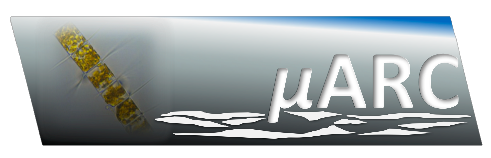

# microARC
**Simulating the microbial planktonic ecosystem in the Arctic waters of Fram Strait.**

This code repository contains scripts to implement a mechanistic, size-structured model representing phytoplankton and zooplankton within 1D water columns.
The model is run in the Lagrangian reference frame so that simulations track water columns and the plankton within them as they are horizontally transported large distances through individual years.
This permits relatively easy assessment of the history of conditions experienced by planktonic ecosystems as they are transported through varying conditions.
This implementation of the model may simulate several thousand pathways guided by ocean currents, that are categorised into two distinct classes: pathways originating in the Arctic, moving southwards with the east Greenland current; and pathways originating in the Atlantic, moving northwards entrained in the west Spitzbergen current.
All of these pathways converge within Fram Strait at a particular time of year, corresponding to when in situ plankton and nutrient sampling was conducted.
Model parameters are numerically optimised to minimise discrepancies between model outputs and in situ observations.
